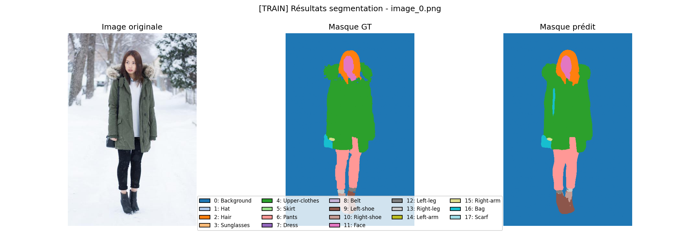

# 🎯 Projet 2 — Requêtez des Services IA

 

  

---

## 📌 Résumé du Projet

**Projet 2 — Requêtez des Services IA**

Ce projet a pour objectif de développer un pipeline complet permettant d’analyser automatiquement des images de mode grâce à un modèle de **segmentation sémantique (SegFormer)**.

---

## 🔧 Fonctionnalités principales
- Chargement et traitement d’un dataset de **50 images de mode**.  
- Segmentation en plusieurs classes : **T-shirt, pantalon, robe, chaussures, accessoires**.  
- Visualisation comparative : **image originale vs masque prédit vs vérité terrain**.  
- Calcul de métriques (**IoU, Dice Score, F1 score**) pour évaluer les performances.  
- Génération d’un rapport synthétique et **export des résultats**.  
- Estimation du **coût de passage à l’échelle** (500 000 images / 30 jours) avec analyse de scénarios (bas / moyen / haut).  
- Respect des normes **RGPD** et **AI Act** pour garantir l’éthique et la conformité réglementaire.

---

## ⚙️ Exécution & Notebook Colab

Je fournis un **Notebook Colab** prêt à l’emploi. Vous pouvez l’ouvrir directement sans installation locale :

**Ouvrez directement le notebook dans Colab (aucune installation locale nécessaire) :**  

---

## 📊 Exemple de Résultat (Segmentation)

|  |

---

## 🛠️ Roadmap (future amélioration + TODO list)

- [ ] **Étendre le dataset** de 50 → 5 000 images pour améliorer la robustesse.  
- [ ] **Tester d’autres architectures** de segmentation (DeepLabV3+, Mask2Former).  
- [ ] **Intégrer un pipeline d’entraînement (fine-tuning)** sur dataset propriétaire.  
- [ ] **Ajouter un tableau de bord interactif** (Streamlit / Gradio) pour la visualisation et l’annotation.  
- [ ] **Optimiser l’inférence** avec ONNX Runtime ou TensorRT pour réduire le temps de calcul.  
- [ ] **Déployer une API REST (FastAPI)** pour intégration dans un environnement e-commerce.  
- [ ] **Mettre en place des tests de conformité automatisés** (RGPD / AI Act checks).  
- [ ] **Ajouter CI/CD** pour tests automatiques et déploiement (GitHub Actions).

---

## 💻 Architecture du projet (aperçu)

- `fashion-trend-intelligence/`
  - `data/`
    - `images/` — Images brutes
    - `annotations/` — Masques de vérité terrain
  - `notebooks/` — Notebooks Colab
  - `src/` — Scripts Python (API, métriques, visualisation)
  - `models/` — Poids et configurations des modèles (si inclus)
  - `outputs/` — Résultats et rapports générés
  - `docs/` — Images d'illustration pour le README
  - `requirements.txt` — Dépendances

---

## 💰 Estimation des coûts (exemple synthétique)
Estimation indicative pour **500 000 images / 30 jours** (hypothèses à personnaliser) :

| Scénario | Hypothèse coût/image | Coût estimé (mois) |
|----------|----------------------|--------------------|
| Bas      | 0,002 $              | 1 000 $            |
| Moyen    | 0,004 $              | 2 000 $            |
| Haut     | 0,006 $              | 3 000 $            |

---

## ✅ Conformité & Éthique
- **RGPD** : anonymisation, conservation limitée, droits d’accès/suppression.  
- **AI Act (UE)** : documentation du modèle, transparence sur l’usage, mesures d’atténuation des biais.  

Je vous recommande d’ajouter un **registre d’activité IA** et des procédures de consentement/gestion des images.

---

## 📚 Sources & Références
- **SegFormer — Hugging Face** : https://huggingface.co/sayeed99/segformer_b3_clothes   
- **Documentation Hugging Face Transformers** : https://huggingface.co/docs/transformers/index  
- **RGPD (texte consolidé / ressource)** : https://gdpr-info.eu/  
- **AI Act (ressource)** : https://artificialintelligenceact.eu/

---

**✍️ Auteur :** Raymond Francius   
📚 *Apprenant - Promotion 09-2025 :* **Engineering Intelligence Artificielle (AI)** — **Openclassrooms**    
🔗 *GitHub :* [https://github.com/RemDev-AI/OpenClassRooms_Projets_AI_Engineer](https://github.com/RemDev-AI/OpenClassRooms_Projets_AI_Engineer)  

---
