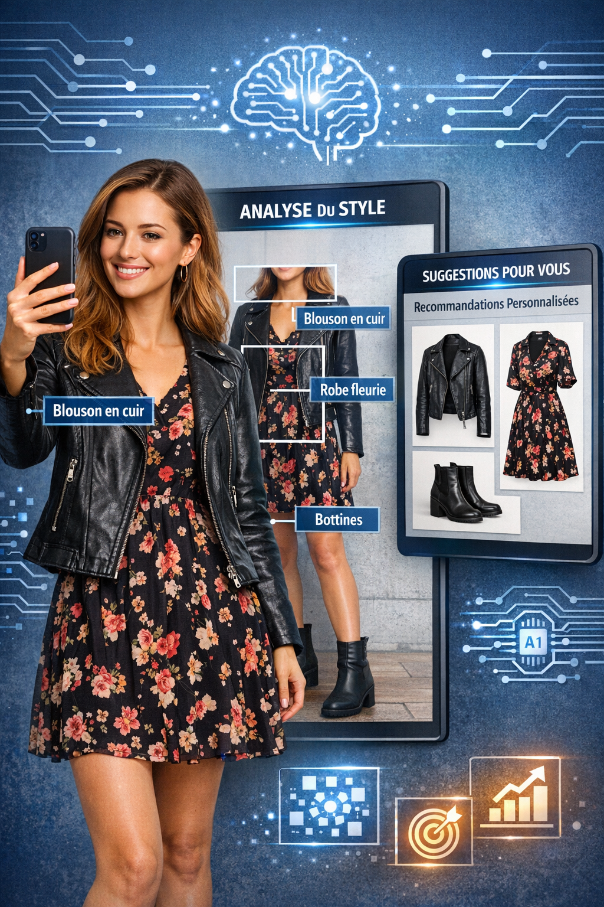
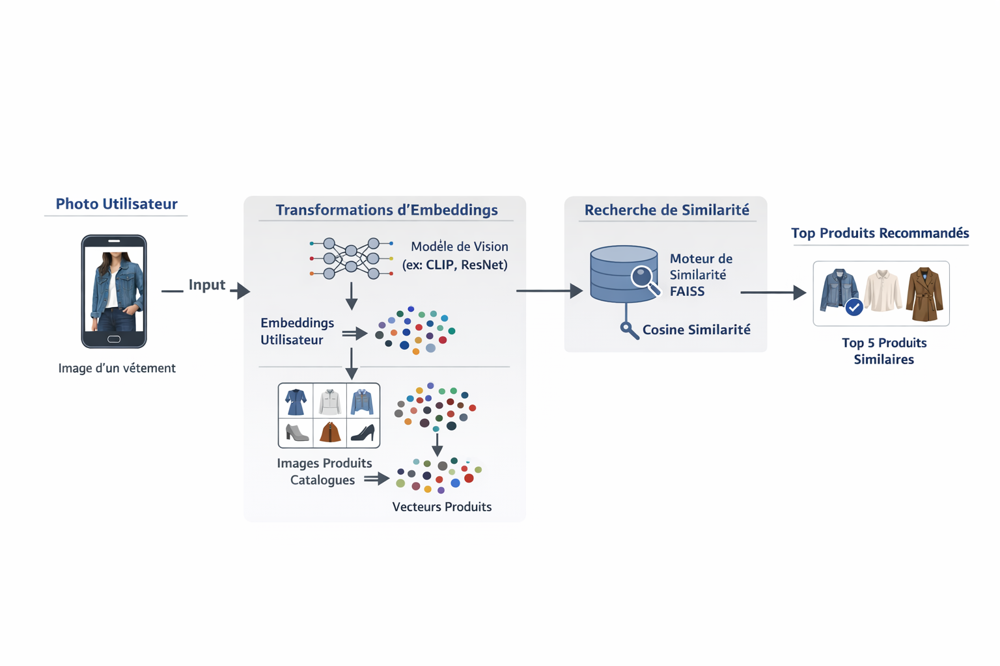

# 📌 Projet-9 --- Réalisez le cadrage d'un projet IA
### *Réalisez un cadrage de projet IA*

------------------------------------------------------------------------

## 🎯 Contexte du projet

L'objectif de l'application mobile est de permettre aux utilisateurs de se prendre en photo avec leurs habits favoris afin d'obtenir des recommandations d'articles similaires correspondant à leur style
vestimentaire.

Le projet s'appuie sur l'écosystème **Microsoft Azure** comme environnement cloud partenaire de Fashion-Insta.

Une réunion stratégique du COMEX est prévue afin d'obtenir la validation pour le lancement d'un **Proof of Concept (POC) IA**.\
La mission consiste à produire un cadrage structuré, économiquement dimensionné et conforme aux exigences réglementaires.

------------------------------------------------------------------------

# 🧩 Partie 1 --- Formalisation du Proof of Concept (POC)

## 🎯 Objectifs du POC

-   Valider la faisabilité technique d'un moteur de recommandation basé
    sur l'analyse d'image.  
-   Tester la pertinence des recommandations vestimentaires.  
-   Évaluer la performance des services Azure.  
-   Identifier les risques techniques et organisationnels. 
 
## 🔬 Hypothèse clé

Un modèle de vision par ordinateur peut extraire des caractéristiques stylistiques (couleurs, motifs, catégories) afin de proposer des articles similaires avec un taux de pertinence mesurable.  

## 📊 Indicateurs de succès

-   Taux de pertinence des recommandations\  
-   Temps moyen de traitement d'une image\  
-   Stabilité de l'architecture cloud\  
-   Validation métier  

------------------------------------------------------------------------

# 🏗️ Partie 2 --- Dimensionnement global du projet

## 🧱 System Design

### 🔎 Architecture cible

-   Application Mobile (Front-End)  
-   API Backend (Azure App Services)  
-   Azure Blob Storage (Stockage images)  
-   Azure Machine Learning (Modèle IA)  
-   Base de données produits (Azure SQL / CosmosDB)  
-   Pipeline MLOps (CI/CD + Monitoring)  

### ⚙️ Principes techniques

-   Scalabilité horizontale  
-   Séparation des environnements (Dev / Test / Prod)  
-   Monitoring & observabilité  
-   Sécurité by design  

------------------------------------------------------------------------

# 🖼️ Architecture Diagram

Un diagramme d'architecture pour illustrer :  

1.  Capture image via application mobile\  
2.  Upload vers Azure Blob Storage\  
3.  Appel API Backend\  
4.  Traitement par modèle IA (Azure ML)\  
5.  Requête base produits\  
6.  Retour des recommandations vers l'application  

------------------------------------------------------------------------

## 📅 Timeline de livraison

  Phase   Objectif                 Durée estimée
  ------- ------------------------ ---------------
  POC     Validation technique     2 mois
  MVP     Industrialisation        3 mois
  Run     Scaling & Optimisation   Année 1

------------------------------------------------------------------------

## 💰 Dimensionnement économique

### 💰 Estimation des coûts

-   Ressources humaines (Data Scientist, Data Engineer, ML Engineer, Product Owner)  
-   Infrastructure Azure (Compute, stockage, services IA)  
-   Monitoring & maintenance  
-   Sécurité & conformité  

### 📈 Projection ROI

Hypothèses métiers :  

-   +5 % augmentation taux de conversion\  
-   +3 % hausse panier moyen\  
-   Amélioration expérience utilisateur\  
-   Réduction temps de recherche produit  

Objectif : démontrer la viabilité économique et la rentabilité à moyen terme.  

------------------------------------------------------------------------

# 🔐 RGPD & Gestion des risques

## Données personnelles concernées

-   Photos utilisateurs\  
-   Métadonnées\  
-   Historique d'usage  

## Mesures de conformité

-   Consentement explicite\  
-   Minimisation des données\  
-   Droit à l'effacement\  
-   Chiffrement des données\  
-   Analyse d'impact (DPIA)  

## Risques identifiés

-   Fuite de données\  
-   Biais algorithmique\  
-   Non-conformité réglementaire\  
-   Mauvaise gouvernance data  

------------------------------------------------------------------------

# 🧰 Stack Technique Détaillée

## ☁️ Cloud & Infrastructure

-   Microsoft Azure\  
-   Azure App Service\  
-   Azure Blob Storage\  
-   Azure SQL / CosmosDB\  
-   Azure Monitor  

## 🤖 Intelligence Artificielle

-   Azure Machine Learning\  
-   Computer Vision\  
-   Python\  
-   Scikit-Learn / PyTorch  

## 🔄 MLOps

-   GitHub Actions (CI/CD)\  
-   Versioning des modèles\  
-   Monitoring de dérive\  
-   Logs & Observabilité  

## 📱 Application

-   API REST\  
-   JSON\  
-   Architecture microservices  

------------------------------------------------------------------------

# 🎓 Objectifs pédagogiques

-   Cadrage stratégique projet IA\  
-   Conception System Design Cloud\  
-   Estimation budgétaire & ROI\  
-   Analyse des risques RGPD\  
-   Présentation exécutive  

------------------------------------------------------------------------

# 🚀 Roadmap

## 🔮 Améliorations futures

-   Recommandation en temps réel\  
-   Personnalisation avancée\  
-   A/B Testing\  
-   Dashboard métier KPI\  
-   Détection tendances mode  

## 📝 TODO

-   [ ] Implémenter pipeline MLOps complet\  
-   [ ] Automatiser monitoring dérive modèle\  
-   [ ] Audit RGPD approfondi\  
-   [ ] Optimisation coûts cloud  

---

**Auteur :** *[Raymond Francius]*   
**Rôle :** *[Apprenant - Promotion Sept-2025]* — **Engineer AI** — **Openclassrooms**    
**Date de mise à jour :** *[20-02-2026]*   
**Client fictif :** Société Financière, nommée "**Prêt à dépenser**"    
**Projet :** Projet-9 - Réalisez le cadrage d'un projet IA  

---
