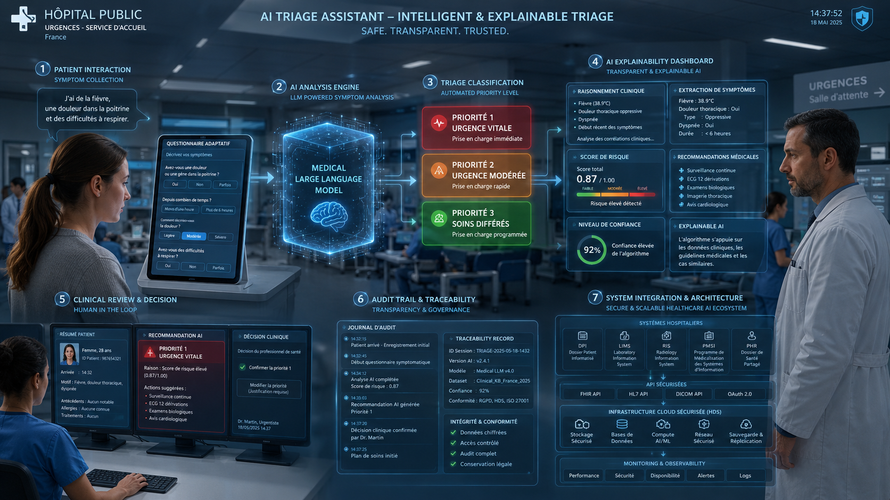

# 🏥🤖 Projet 14 - Finetunez votre propre LLM 

**Mission - Développez le POC d'un agent de triage médical**

✍️ **Auteur :** *[Raymond Francius]*    
📚 **Rôle :** *[Apprenant - Promotion Sept-2025]* — **Engineer AI** — **Openclassrooms**   
🗓️ **Date de mise à jour :** *[21-07-2026]*  

---

Repo GitHub : [https://github.com/RemDev-AI/medical-triage-agent-ai-poc](https://github.com/RemDev-AI/medical-triage-agent-ai-poc)

---

## 1. Contexte du projet

Le Centre Hospitalier Saint-Aurélien (CHSA), grand hôpital public français, fait face à une surcharge constante de son service des urgences, en particulier aux heures de pointe. Le personnel infirmier et de triage manque parfois d'effectifs, ce qui entraîne des temps d'attente prolongés et un risque de négligence de cas critiques non identifiés à temps. Ce projet répond à ce besoin en développant un Proof of Concept d'agent IA de triage médical, destiné à assister les équipes soignantes dans l'évaluation initiale des patients.

L'objectif n'est pas de remplacer le personnel médical, mais de lui fournir un outil d'aide à la décision fiable, traçable et explicable. Le POC vise à démontrer la faisabilité technique et la valeur clinique ajoutée d'un tel système avant tout passage à l'échelle.

## 2. Objectifs de l'agent IA

L'agent IA de triage a été conçu pour répondre à cinq exigences fonctionnelles principales.

- 📋 Collecter les symptômes du patient via un questionnaire intelligent adaptatif
- 🚦 Évaluer le niveau de priorité (urgence maximale / modérée / différée) selon les protocoles médicaux
- 💬 Fournir des explications claires sur l'évaluation et les recommandations formulées
- 🔗 S'intégrer au système d'information hospitalier existant
- 🗂️ Garantir la traçabilité de chaque interaction à des fins d'audit médical

## 3. Vision globale du système

Le schéma ci-dessous présente l'architecture fonctionnelle complète du système, de l'interaction patient jusqu'à l'intégration avec les systèmes hospitaliers.

Le flux se déroule en sept étapes : collecte des symptômes, analyse par un modèle de langage médical, classification en trois niveaux de priorité, restitution explicable des résultats (score de risque, niveau de confiance), revue clinique par un professionnel de santé (human-in-the-loop), journalisation complète pour l'audit, et enfin intégration sécurisée avec les systèmes hospitaliers (DPI, LIMS, RIS, PMSI, PHR) via des API standardisées (FHIR, HL7, DICOM).

## 4. Approche technique

Le projet s'appuie sur les avancées récentes de l'IA médicale, qui montrent que des modèles de langage spécialisés peuvent atteindre des performances diagnostiques comparables à celles de médecins en formation (voir [l'étude JAMA Network Open](https://jamanetwork.com/journals/jamanetworkopen/fullarticle/2825395)). Le déploiement en environnement clinique nécessite toutefois une méthodologie rigoureuse et une validation approfondie à chaque étape.

La stratégie s'articule autour de trois phases progressives.

> **Phase 1 - Validation conceptuelle**
> Déploiement du modèle [Qwen3-1.7B-Base](https://huggingface.co/Qwen/Qwen3-1.7B-Base), compact mais performant, pour valider rapidement les hypothèses techniques et évaluer l'acceptabilité clinique du système par les équipes soignantes.

> **Phase 2 - Optimisation ciblée**
> Fine-tuning supervisé (SFT) du modèle via la technique LoRA, puis alignement par préférences (DPO) pour garantir sa conformité aux protocoles médicaux établis.

> **Phase 3 - Projection industrielle**
> En cas de validation concluante du POC, passage envisagé à des modèles de plus grande envergure (32B+ paramètres) avec des jeux de données étendus, pour une mise en production à l'échelle.

## 5. Feuille de route de la mission (4 semaines)

Le développement du POC est structuré en quatre semaines, chacune correspondant à une étape clé du pipeline IA.

| Semaine | Objectif principal                       | Livrable clé                                          |
|---------|------------------------------------------|-------------------------------------------------------|
| **1**   | Préparation et structuration des données | Dataset SFT (5 000 paires)                            |
|         |                                          |  + dataset DPO, anonymisés et conformes RGPD          |
| **2**   | Fine-tuning supervisé (SFT) avec LoRA    | Modèle Qwen3-1.7B spécialisé sur le corpus médical    |
| **3**   | Alignement par préférences (DPO)         | Modèle aligné sur les pratiques cliniques validées    |
| **4**   | Déploiement et validation                | Endpoint vLLM, rapport de synthèse, recommandations   |

### Détail des sources de données (Semaine 1)

- [MediQA](https://huggingface.co/datasets/ANR-MALADES/MediQAl)
- FrenchMedMCQA
- MedQuAD
- [UltraMedical-Preference](https://huggingface.co/datasets/TsinghuaC3I/UltraMedical-Preference)

## 6. Livrables attendus

Quatre livrables principaux sont produits à l'issue de la mission.

- 📦 **Dataset médical bilingue prêt à l'emploi** : corpus francophone et anglophone nettoyé, structuré et anonymisé en conformité RGPD, optimisé pour le SFT et le DPO
- 🤖 **Modèle d'IA spécialisé** : Qwen3-1.7B fine-tuné (SFT + LoRA) puis aligné par préférences (DPO), poids finaux fournis
- ☁️ **Endpoint de démonstration déployé sur le cloud** : interface accessible via API, optimisée pour l'inférence rapide grâce à vLLM
- ⚙️ **Pipeline CI/CD** : mis en place avec GitHub Actions, automatisant les tests et le déploiement des nouvelles versions du modèle

## 7. Stack technique

| Catégorie      | Technologies                    |
|----------------|---------------------------------|
| Modèle de base | Qwen3-1.7B-Base                 |
| Fine-tuning    | SFT, LoRA                       |
| Alignement     | DPO                             |
| Inférence      | vLLM                            |
| Intégration    | API FHIR / HL7 / DICOM          |
| CI/CD          | GitHub Actions                  |
| Conformité     | RGPD, anonymisation des données |

### TODO technique

- [x] Finaliser le nettoyage et l'anonymisation du dataset RGPD
- [x] Automatiser l'évaluation du modèle sur un jeu de test clinique dédié
- [x] Ajouter des tests unitaires et d'intégration au pipeline CI/CD
- [x] Documenter l'API de l'endpoint de démonstration
- [x] Rédiger le rapport de synthèse et les recommandations de passage à l'échelle

## 8. Roadmap

Cette section liste les axes d'amélioration envisagés au-delà du périmètre du POC actuel.

### Prochaines évolutions

- [ ] Passage à un modèle de plus grande envergure (32B+ paramètres) pour la mise en production
- [ ] Extension du dataset médical à d'autres langues et spécialités cliniques
- [ ] Intégration native avec le Dossier Patient Informatisé (DPI) du CHSA
- [ ] Mise en place d'un tableau de bord de monitoring en production (dérive du modèle, latence, taux d'escalade)
- [ ] Certification et validation réglementaire (dispositif médical, marquage CE le cas échéant)
- [ ] Étude d'acceptabilité clinique à plus grande échelle auprès des équipes soignantes

## 9. Avertissement

Ce projet est un Proof of Concept à visée expérimentale et pédagogique. Il ne constitue pas un dispositif médical certifié et ne doit pas être utilisé pour une prise de décision clinique réelle sans validation, supervision et certification appropriées.
